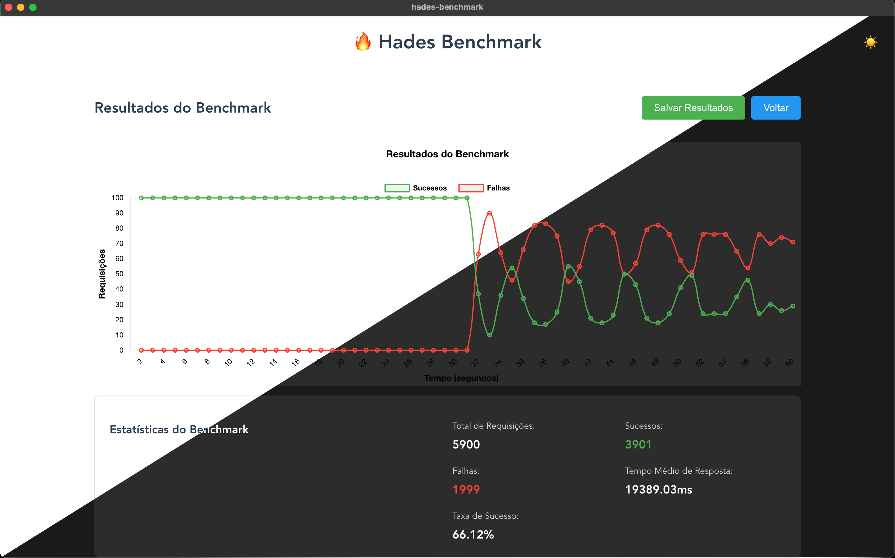

<div align="center">
  

  # 🔥 Hades Benchmark
</div>

  Uma ferramenta de benchmark de API desenvolvida com Vue.js e Electron, permitindo testar o desempenho de múltiplos endpoints simultaneamente.

  ## Características

  - Interface gráfica intuitiva
  - Suporte a múltiplos endpoints simultâneos
  - Configuração personalizada de headers
  - Métodos HTTP: GET, POST, PUT, DELETE
  - Gráficos em tempo real
  - Estatísticas detalhadas
  - Suporte a corpo de requisição JSON
  - Configuração de requisições por segundo
  - Duração personalizada por endpoint

  ## Requisitos

  - Node.js 14.x ou superior
  - npm 6.x ou superior

  ## Instalação

  1. Clone o repositório:
  ```bash
  git clone https://github.com/seu-usuario/hades-benchmark.git
  cd hades-benchmark
  ```

  2. Instale as dependências:
  ```bash
  npm install
  ```

  ## Execução

  ### Modo Desenvolvimento

  Para executar em modo de desenvolvimento:

  ```bash
  npm run serve
  ```

  A aplicação estará disponível em `http://localhost:3400`

  ### Modo Electron

  Para executar a versão desktop:

  ```bash
  npm run start
  ```

  ## Geração de Binários

  ### macOS
  ```bash
  npm run build:mac
  ```
  Gera:
  - `.dmg` (instalador)
  - `.zip` (versão portátil)

  ### Linux
  ```bash
  npm run build:linux
  ```
  Gera:
  - `.AppImage` (versão portátil)
  - `.deb` (instalador para distribuições baseadas em Debian)

  ### Windows
  ```bash
  npm run build:win
  ```
  Gera:
  - `.exe` (instalador NSIS)
  - `.exe` (versão portátil)

  Os binários serão gerados na pasta `dist_electron`.

  ## Como Usar

  1. **Configuração Base**
     - Insira a URL base da API (ex: `https://api.example.com`)
     - Adicione os headers necessários (ex: Authorization, Content-Type)

  2. **Configuração de Endpoints**
     - Clique em "+ Adicionar Endpoint"
     - Configure para cada endpoint:
       - Path (ex: `/api/users`)
       - Método HTTP (GET, POST, PUT, DELETE)
       - Requisições por segundo
       - Duração em segundos
       - Corpo da requisição (para métodos não-GET)

  3. **Execução do Benchmark**
     - Clique em "Iniciar Benchmark"
     - Observe o gráfico em tempo real
     - Acompanhe o tempo restante
     - Use "Parar Benchmark" para interromper o teste

  4. **Análise de Resultados**
     O gráfico mostra:
     - Linha verde: requisições bem-sucedidas
     - Linha vermelha: requisições com falha
     
     Estatísticas disponíveis:
     - Total de requisições
     - Número de sucessos
     - Número de falhas
     - Tempo médio de resposta
     - Taxa de sucesso

  ## Desenvolvimento

  ### Estrutura do Projeto
  ```
  hades-benchmark/
  ├── src/
  │   ├── components/
  │   │   ├── BenchmarkForm.vue    # Formulário de configuração
  │   │   ├── BenchmarkChart.vue   # Componente do gráfico
  │   │   └── Benchmark.vue        # Componente principal
  │   ├── App.vue                  # Componente raiz
  │   └── main.js                  # Ponto de entrada
  ├── public/
  ├── dist/                        # Build da aplicação web
  ├── dist_electron/              # Binários gerados
  └── package.json
  ```

  ### Scripts Disponíveis

  - `npm run serve`: Inicia o servidor de desenvolvimento
  - `npm run build`: Gera a build da aplicação web
  - `npm run start`: Inicia a aplicação Electron
  - `npm run lint`: Executa o linter
  - `npm run build:mac`: Gera binário para macOS
  - `npm run build:linux`: Gera binário para Linux
  - `npm run build:win`: Gera binário para Windows

  ## Contribuindo

  1. Faça um fork do projeto
  2. Crie uma branch para sua feature (`git checkout -b feature/nova-feature`)
  3. Commit suas mudanças (`git commit -m 'Adiciona nova feature'`)
  4. Push para a branch (`git push origin feature/nova-feature`)
  5. Abra um Pull Request

  ## Licença

  Este projeto está licenciado sob a licença MIT - veja o arquivo [LICENSE](LICENSE) para detalhes.
